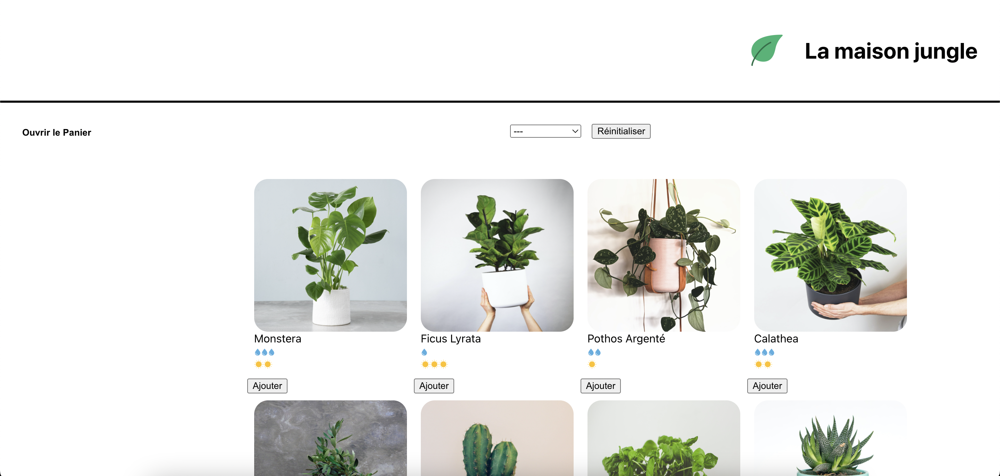
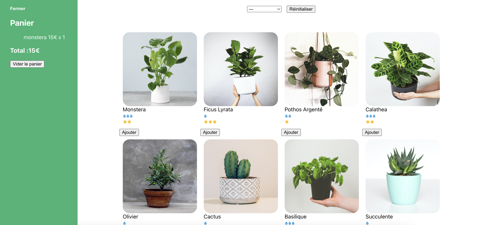

# La Maison Jungle
## Learning React with OpenClassrooms

This is a little exercice from the React OpenClassrooms course. It cover the basics of React, you can learn how to create your first component and how component interact with each others.

### Screenshot

### Built with

- HTML5
- CSS
- React

## Author

- Caroline Lienard (https://github.com/CarolineLienard)
- OpenClassrooms (https://openclassrooms.com/fr/) 

#### Note: If you are student, do your best to create your own solution, you got this 👍🏻
